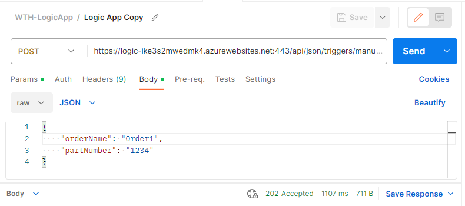
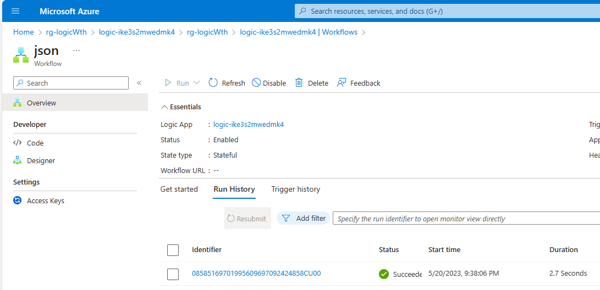

# Challenge 01 - Initial Workflow - Coach's Guide 

[< Previous Solution](./Solution-00.md) - **[Home](./README.md)** - [Next Solution >](./Solution-02.md)

## Notes & Guidance

1.  Navigate to the Logic App in the Azure portal.

1.  Click on the `Workflows` blade, then `Add`. Name it `json` and select `Stateful`.

1.  Click on the `Designer` blade.

1.  Add a `When a HTTP request is received` trigger.

1.  Add a `Parse JSON` action & use the `Use sample payload to generate schema` link to generate the schema based upon the JSON payload below:

    ```json
    {
        "orderName": "Order1",
        "partNumber": "1234"
    }
    ```

    It should look something like this when complete.

    

1.  Add a `Upload blob to storage container` action to the workflow to write a JSON file to the Blob Storage account that ends in `files` and has a container named `files`.

    1.  Set the `Container name` to `files`

    1.  Set the `Blob name` to `utcNow()/order.json` so you get unique filenames (note the use of the `utcNow()` function, use the `Expression` tab to add the function, then the suffix as text). If you look in the `Code View`, it should look similar to  the following.

        ```json
        {
          "inputs": {
            "parameters": {
                "containerName": "files",
                "blobName": "@{utcNow()}/order.json",
                "content": "@body('Parse_JSON')"
            },
            "serviceProviderConfiguration": {
                "connectionName": "AzureBlob",
                "operationId": "uploadBlob",
                "serviceProviderId": "/serviceProviders/AzureBlob"
            }
          }
        }
        ```

    1.  Set the Content to the `Body` of the `Parse JSON` action.

    It should look something like this when complete.

    

1.  The completed workflow should be similar to the following.

    

1.  Click `Save`.

1.  Copy the `HTTP POST URL` from the `When a HTTP request is received` trigger.

1.  Open `Postman` and create a new `POST` request with the URL copied before.

1.  Set the body type to `raw` and the format to `JSON`.

1.  Set the body to the following JSON:

    ```json
    {
        "orderName": "Order1",
        "partNumber": "1234"
    }
    ```

1.  Click `Send` and you should get a `202 Accepted` response.

    

1.  You should also verify the run succeeded by looking at the `Run history` on the `json` workflow in the Azure portal.

    

## Troubleshooting

Check the Application Settings for the Logic App to ensure a new App Setting for the Storage Account has been created. It will look something like this:

```json
{
  "name": "AzureBlob_connectionString",
  "value": "DefaultEndpointsProtocol=https;AccountName=st5vufwrvt62ry2files;AccountKey=CrTuG1pSX9hrR9QBCXxTdGorFakekeyEfGXDbp03r0i8sRiUVT2O+AStoXeLnw==;EndpointSuffix=core.windows.net",
  "slotSetting": false
}
```

>NOTE: If the students create any connections in the Azure portal, but then re-deploy the Bicep templates, they will wipe out any Application Settings that were created. These will have to be recreated or the Logic App will not work.