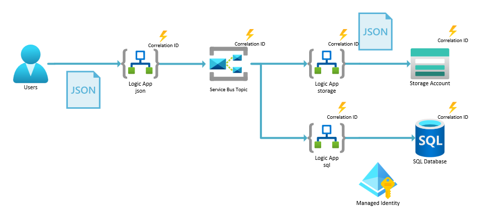

# Challenge 04 - Monitor end-to-end workflow

[< Previous Challenge](./Challenge-03.md) - **[Home](../README.md)** - [Next Challenge >](./Challenge-05.md)

## Introduction

A key consideration when building a distributed system is tracking requests through the system. This is especially important when requests are separated by queues such as Service Bus. In this challenge, you will add a correlation ID to the incoming HTTP request and propagate it through the application. You will then use Application Insights to view the correlation ID propagating through the logs.

## Description

You will be modifying the Logic App workflows to enable the following architecture.

- Add a correlation ID to the incoming HTTP request & propagate it through the application
  - `json` workflow
    - Modify the `Tracking Id` section of the `HTTP` trigger (in the `Settings` tab)
    - Modify the `Send message` action of the `json` workflow (add the `Correlation` parameter)
  - `storage` workflow
    - Modify the `Split-On Tracking Id` section of the `When messages are available in a topic` Service Bus trigger (in the Settings tab), 
    - Parse the JSON document from the Service Bus, compose a new JSON document with the correlation ID & upload the blob to the container
  - `sql` workflow
    - Modify the `Split-On Tracking Id` section of the `When a blob is added or modified` blob trigger (in the Settings tab) & insert the row into the table (include the correlation ID)
- View the `Application map` in Application Insights to get an overview of the application calls
- View the `Logs` & the `requests` table in Application Insights to see the raw data
- View the correlation ID propagating through the logs in the Application Insights `Tracking search` blade
  - Filter on `prop__clientTrackingId` and get the correlation ID from the starting `json` workflow last execution run
- Try again by passing a custom header `x-my-custom-correlation-id` with a unique value and look at the `Tracking search` logs again to see that you can now correlate with a custom ID instead of a random GUID.

## Success Criteria

To complete this challenge successfully, you should be able to:
- Verify that a correlation ID is being added to all steps of the workflow & is being persisted to Blob Storage & SQL
- Verify that you can filter on this correlation ID in the Application Insights logs

## Learning Resources

- [Custom Tracking Properties](https://learn.microsoft.com/en-us/azure/logic-apps/monitor-workflows-collect-diagnostic-data?tabs=standard#custom-tracking-properties)
- [Compose Action](https://learn.microsoft.com/en-us/azure/logic-apps/logic-apps-perform-data-operations?tabs=standard#compose-action)
- [Application Insights Transaction Search](https://learn.microsoft.com/en-us/azure/azure-monitor/app/diagnostic-search)

## Tips
- Use the following code to either use the correlation ID passed in by the caller or generate a new one.
  - `@{coalesce(triggerOutputs().headers?['x-my-custom-correlation-id'], guid())}`
- Use the following code to set the correlation ID on the outgoing message to Service Bus.
  - `trigger().clientTrackingId`
- Use the following code to set the correlation ID on the incoming message from Service Bus.
  - `@{coalesce(triggerOutputs()?['body']?['correlationId'], guid())}`
- Use the `Compose` action to build a new `JSON` document to insert into Blob Storage