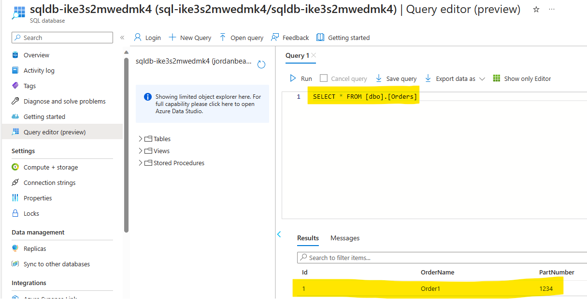

# Challenge 02 - Write to SQL - Coach's Guide 

[< Previous Solution](./Solution-01.md) - **[Home](./README.md)** - [Next Solution >](./Solution-03.md)

## Notes & Guidance

1.  Open the SQL database (not the SQL server) in the Azure portal.

1.  Click on the `Query editor` blade and login using Active Directory authentication.

1.  Create the `Orders` table by running the following `SQL`.

    ```sql
    CREATE TABLE [dbo].[Orders] (
      [Id]               [int]          IDENTITY(1,1) NOT NULL,
      [OrderName]        [nvarchar](50)               NOT NULL,
      [PartNumber]       [nvarchar](50)               NOT NULL,
      [ClientTrackingId] [nvarchar](50),
      [SAPOrderId]       [nvarchar](50)
    );
    GO;
    ```

1.  Create a `SQL ID` for the managed identity & grant it the `db_owner` role. Get the name of the managed identity from the Azure portal (it will follow the convention of `id-<suffix>`)

    ```sql
    CREATE USER [id-ike3s2mwedmk4] FROM EXTERNAL PROVIDER;
    ALTER ROLE db_owner ADD MEMBER [id-ike3s2mwedmk4];
    GO;
    ```

1.  Open the Logic App, select the `json` workflow and open the Designer in the Azure portal.

1.  Add a new `SQL Server->Insert row (V2)` action to the workflow. Make sure and set the `Authentication type` to `Logic Apps Managed Identity` when you create the connection.

1.  Set the `Server name` to the `FQDN` of the `SQL Server`

1.  Set the `Database name` to the name of the SQL Database

1.  Click the drop-down & select the `Orders` table

1.  Set the `OrderName` column to the `orderName` field from the `Parse JSON` action

1.  Set the `PartNumber` column to the `partNumber` field from the `Parse JSON` action

1.  Your `Insert row (V2)` action should look like this:

    

1.  Your final worklow should look like this:

    

1.  Run the `HTTP POST` command in Postman and confirm that data is written to both the Blob Storage account & the new SQL table.

    ```sql
    SELECT * FROM [dbo].[Orders];
    ```

    

## Troubleshooting

Make sure to create the `SQL ID` & grant it roles before trying to use the Logic Apps GUI to insert the row. If you don't, you will get an error that the `SQL ID` doesn't have permissions to the database.

Don't use the _preview_ version of the workflow editor in the Azure portal.

You may have to create a new SQL connection if you created the connection before you created the `SQL ID`.