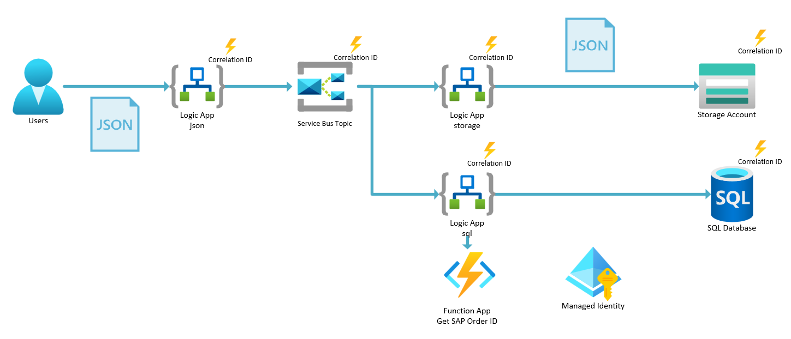

# Challenge 07 - Authenticate with AzureAD when calling custom API

[< Previous Challenge](./Challenge-06.md) - **[Home](../README.md)** - [Next Challenge >](./Challenge-08.md)

## Introduction

It is very common for Logic Apps to need to call out to other APIs as part of the workflow. These APIs are often protected via OAuth2. 

## Description

In this challenge, you will learn how to call out to a custom API that is protected by Azure Active Directory.

The architecture of the solution is as follows:



- Review the code for the pseudo-SAP order system (especially how to call it)
  - Look in the `src/api` directory
  - Try to call the endpoint that is deployed to Azure using Postman to get a feel for how to call it
- Enable `EasyAuth` on the Azure Function to simulate having to authenticate against an OAuth2 endpoint to get an SAP order number
  - Use the `Microsoft` identity provider (which will automatically create an app registration in your tenant)
  - Enable the `HTTP 401 Unauthorized: recommended for APIs` option
  - Copy the `App (client) ID` for use later.
- Get the following info out of Azure Active Directory so you can assign the managed identity access to call your Function App
  - The `Object ID` of the `Enterprise App` (service principal) that was created when you enabled `EasyAuth` on the Function App (same name as the Function App)
- Get the `Object ID` of the `Managed Identity` that was created by the deployment script
- Grant the Managed Identity access to call the Azure Function
- Modify the `sql` Logic App workflow to call out to the Azure Function to get the SAP order number
  - Add a `HTTP` action to the workflow & call the Azure Function (using `Managed identity` authentication)
  - Add a `Parse JSON` action to parse the results of the call to the SAP order number function
  - Add the results of the call to the SAP order number system to the row that is being inserted into the database

You can view an architectural diagram of an IoT thingamajig here: [Thingamajig.PDF](/Student/Resources/Architecture.PDF?raw=true).

## Success Criteria

To complete this challenge successfully, you should be able to:
- Verify that Easy Auth has been enabled to protect the Azure Function
- Verify the `sql` Logic App workflow is calling the Azure Function to get the SAP order number
- Verify the `sql` Logic App workflow is inserting the SAP order number into the database

## Learning Resources

- [Run Azure Functions locally](https://learn.microsoft.com/en-us/azure/azure-functions/functions-develop-local)
- [Easy Auth](https://learn.microsoft.com/en-us/azure/app-service/overview-authentication-authorization)

## Tips
- Use the `func start` command to run the Azure Function locally
- Go to the `Enterprise Applications` blade in Azure Active Directory to find the `Object ID` of the `Enterprise App` (service principal) that was created when you enabled `EasyAuth` on the Function App (same name as the Function App)
- Use the following command to grant the Managed Identity access to the Function App service principal (you can run this in the Cloud Shell, substitute your own values)
  ```powershell
  New-AzureADServiceAppRoleAssignment -ObjectId {MANAGED-IDENTITY-OBJECT-ID} -Id 00000000-0000-0000-0000-000000000000 -PrincipalId {MANAGED-IDENTITY-OBJECT-ID} -ResourceId {ENTERPRISE-APP-OBJECT-ID}
  ```
- The `audience` of the Managed Identity authentication will be the `App (client) ID` of the Function App
