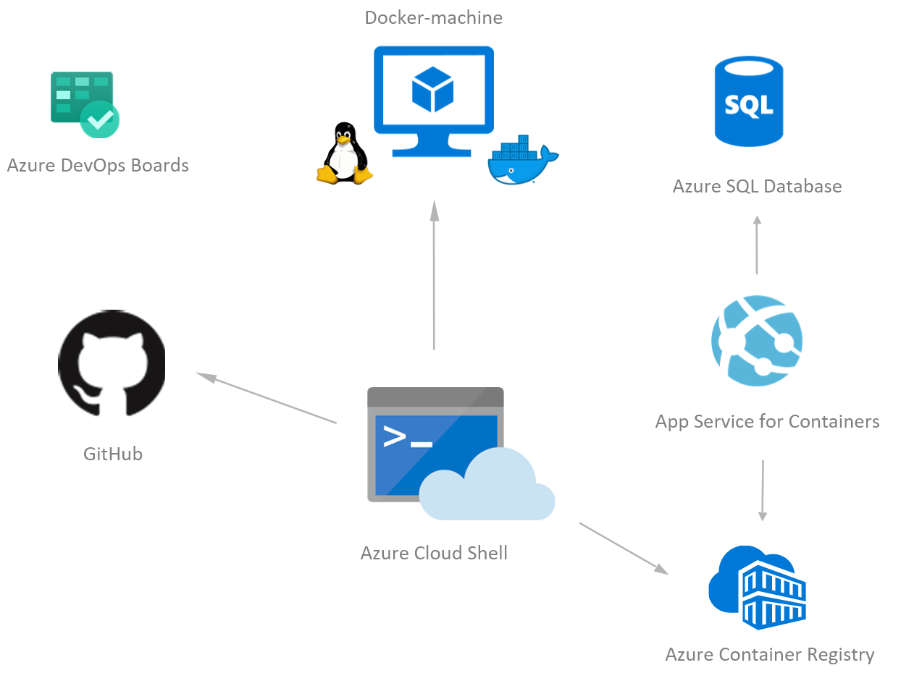

# Challenge 03 - Run the app on Azure

[< Previous Challenge](./Challenge-02.md) - **[Home](../README.md)** - [Next Challenge >](./Challenge-04.md)

## Introduction

In a previous challenge we deployed the app on Azure but into an Azure Docker-machine playing the role of your local machine. Now with this challenge you will be able to provision an Azure Web App Service for Containers to host your "Rock Paper Scissors Boom" app.

## Description

1. Provision an Azure Web App Service for Containers via Infrastructure-as-Code from within Azure Cloud Shell. The approach here is to leverage the Azure CLI (not the Azure portal) by executing a series of bash commands. Do you remember? _Friends don't let friends use UI to provision Azure services, right? ;)_
1. Take the same approach to provision an Azure Container Registry (ACR) to push your container in it.
1. Deploy the app in your Azure Web App Service for Containers by pulling the Docker image from your ACR previously created, test it as an end-user, and play a game once deployed there.

## Success Criteria

To complete this challenge successfully, you should be able to:

1. In Azure Cloud Shell, make sure `az webapp list`, `az acr list` and `az acr repository show-tags` are showing your Azure services properly.
   1. Where is stored your connection string? Have you leveraged `az webapp config connection-string`, you should have!
1. In your web browser, navigate to the app and play a game, make sure it's working without any error.
1. In GitHub, make sure you documented the different commands you have used to provision your infrastructure. It could be in a `.md` file or in `.sh` file. You will complete this script as you are moving forward with the further challenges.
1. Be sure you don't commit any secrets/passwords into a public GitHub repo.
1. In Azure DevOps (Boards), from the Boards view, you could now drag and drop the user story associated to this Challenge to the `Resolved` or `Closed` column, congrats! ;)

## Learning Resources

1. To use a custom Docker image for Web App for Containers, [here you are](https://docs.microsoft.com/en-us/azure/app-service/containers/tutorial-custom-docker-image)! The "Use a Docker image from any private registry" section is specifically what you are looking for.
1. [Azure Web App Service CLI documentation](https://docs.microsoft.com/en-us/cli/azure/webapp)
1. [Azure Container Registry CLI documentation](https://docs.microsoft.com/en-us/cli/azure/acr)
1. You could execute the `git` commands "locally" from within your Azure Cloud Shell, or you could leverage the web editor directy from GitHub.

## Tips

- [Cloud computing hosting decision tree](https://docs.microsoft.com/en-us/azure/architecture/guide/technology-choices/compute-decision-tree)
- [Azure App Service, Virtual Machines, Service Fabric, and Cloud Services comparison](https://docs.microsoft.com/en-us/azure/app-service/choose-web-site-cloud-service-vm)
- [Containers hosting options in Azure](https://azure.microsoft.com/en-us/overview/containers/)
- [Azure CLI](https://docs.microsoft.com/en-us/cli/azure)
- [Azure ARM Templates](https://docs.microsoft.com/en-us/azure/azure-resource-manager/)
- [Ansible for Azure](https://docs.microsoft.com/en-us/azure/ansible/)
- [Terraform for Azure](https://docs.microsoft.com/en-us/azure/terraform/)
- [Azure App Service diagnostics overview](https://docs.microsoft.com/en-us/azure/app-service/app-service-diagnostics)
